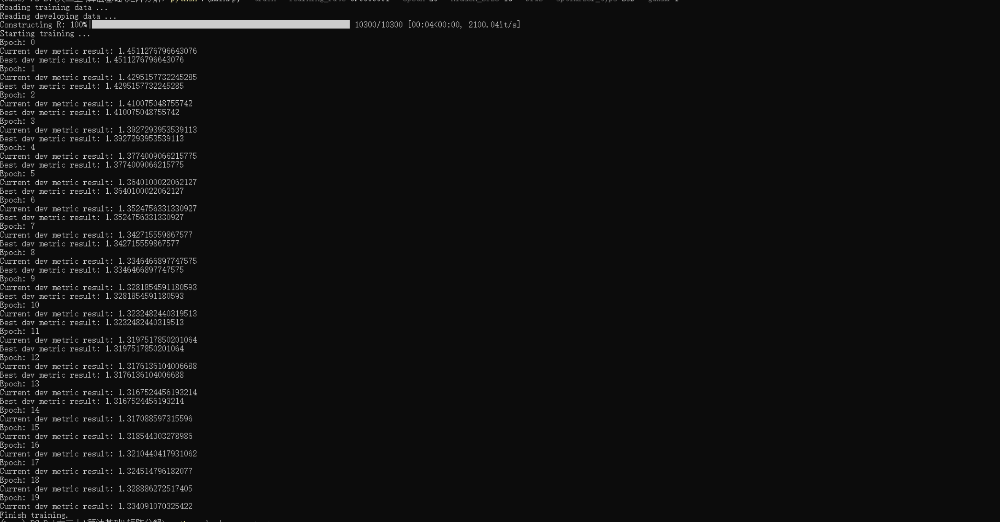
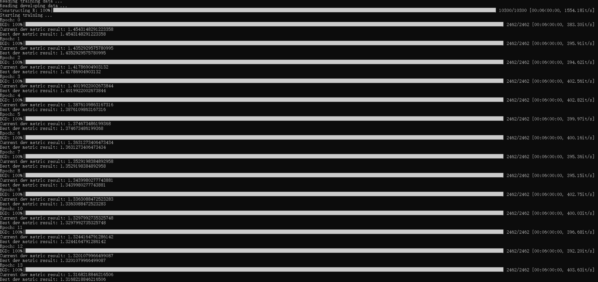
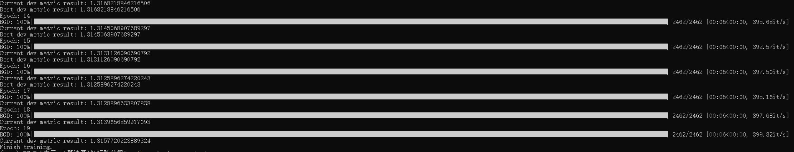
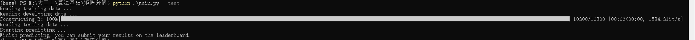
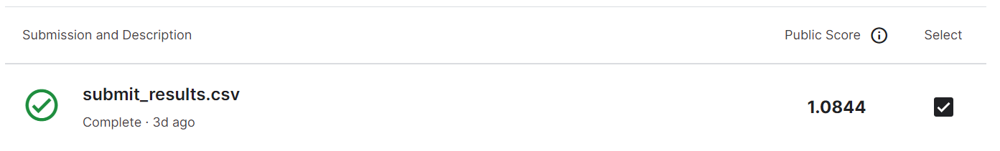
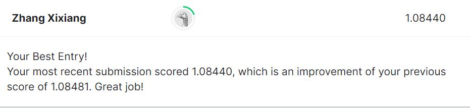

<h1 style="text-align: center">华东师范大学数据科学与工程学院实验报告</h1>

|      |    |              |
| ------------------------------------ | ------------ | --------------------------- |
| 课程名称: 数据科学与工程算法基础     | 年级: 20级   | 上机实践成绩：              |
| 指导教师: 高明                       | 姓名:张熙翔   | 学号: 10205501427           |
| 上机实践名称: 基于矩阵分解的推荐系统 |              | 上机实践日期: 2022年12月8日 |

### 一.实验目的
 
​在信息化和大数据的时代，推荐系统是解决如何精准地挖掘出用户的偏好这一问题的一个研究主题。本次次实践作业关于如何使用矩阵分解技术解决推荐问题。  

问题定义：给定一个用户评分矩阵 $\mathbf{R}\in\mathbb{R}^{m\times n}$，其中$m$为用户（user）的数量，$n$为物品（item）的数量。矩阵元素$r_{ij}\in\mathbf{R}$表示用户$u_i$为物品$v_j$的评分值。任务目标有两个：
- 通过矩阵分解和凸优化技术，获得每个用户$u_i$和物品$v_j$的隐式向量，分别记作$\mathbf{u}_i\in\mathbb{R}^{k}$和$\mathbf{v}_i\in\mathbb{R}^{k}$，其中$k$为向量维度；所有用户和物品分别组成矩阵$\mathbf{P}\in\mathbb{R}^{m\times k}$和$\mathbf{Q}\in\mathbb{R}^{n\times k}$；
- 根据获得的用户和物品向量，预测该用户对某个物品的偏好程度$\hat{r}_{ij}=\mathbf{u}_i\mathbf{v}_i^{T}$；

因为在实际应用中，这个用户评分矩阵式稀疏的。例如某电影网站一共有100k用户和10k部电影，有一些用户可能只看不超过10部电影，或者有些的电影可能被观影的人数很少。换句话说，这个用户评分矩阵存在大量的缺失值，因此通过矩阵分解可以先挖掘出已存在的用户行为，再预测这些缺失值。

### 二.数据集
选取电影评分数据集，包括约20k用户和10k物品。总共有超过240k评分数据。根据评分数据划分了训练集（237k评分数据）、验证集（10k评分数据）和测试集（50k评分数据）。
- 其中训练集和验证集中，每一条数据表示为$(u_i, v_j, r_{ij})$三元组；
- 测试集则用于评测，其只有用户和商品$(u_i, v_j)$，需要预测出他们的评分；
- 验证集和测试集中出现的所有用户和商品确保一定在训练集中存在，即不考虑冷启动问题；

### 三.实验任务

1. 实现矩阵分解推荐系统项目，包括数据读取、模型训练、优化算法、模型验证与测试；
   - 实现随机梯度下降和批量梯度下降算法，完成$\mathbf{P}$和$\mathbf{Q}$矩阵的参数更新；
   - 进一步优化算法，包括正则化、偏置项和协同过滤；
   - 使用或自研其他算法技术来进一步提升矩阵分解的泛化性能；

2. 完成代码后，将训练好的模型在测试集上进行预测；
3. 对矩阵分解在推荐系统的应用背景介绍、个人理解；
   - 几种优化算法、以及改进算法的代码实现原理，以及对应的实验对比结果；
   - 探索矩阵分解算法的一些优势和缺点；
   - 项目完成感悟和总结。

### 四.实验过程

#### 主程序
设置超参数，包括学习率、迭代次数、隐藏层大小、后续算法优化选项等。
```
import pandas as pd
import numpy as np
from tqdm import tqdm
import argparse
from model import MatrixDecomForRecSys
from metrics import RMSE

np.random.seed(42)

if __name__ == '__main__':
    # set hyper-parameter
    parser = argparse.ArgumentParser(description="Command")
    parser.add_argument('--learning_rate', default=0.02, type=float)
    parser.add_argument('--batch_size', default=8, type=int)
    parser.add_argument('--epoch', default=10, type=int)
    parser.add_argument('--reg_p', default=0.01, type=float)
    parser.add_argument('--reg_q', default=0.01, type=float)
    parser.add_argument('--reg_b', default=0.01, type=float)
    parser.add_argument('--gamma', default=0, type=float)
    parser.add_argument('--hidden_size', default=16, type=int)
    parser.add_argument('--bias',
                        default=True,
                        action='store_true',
                        help='add bias')
    parser.add_argument('--optimizer_type',
                        default="SGD",
                        type=str,
                        help="SGD or BGD")
    parser.add_argument('--train',
                        default=False,
                        action='store_true',
                        help='is train')
    parser.add_argument('--test',
                        default=False,
                        action='store_true',
                        help='is test')

    args = parser.parse_args()

    # reading training data
    dtype = [("userId", np.int32), ("movieId", np.int32),
             ("rating", np.float32)]
    print("Reading training data ...")
    train_dataset = pd.read_csv("data/train.csv",
                                usecols=range(3),
                                dtype=dict(dtype))
    print("Reading developing data ...")
    dev_dataset = pd.read_csv("data/dev.csv",
                              usecols=range(3),
                              dtype=dict(dtype))

    model = MatrixDecomForRecSys(lr=args.learning_rate,
                                 batch_size=args.batch_size,
                                 reg_p=args.reg_p,
                                 reg_q=args.reg_q,
                                 reg_b=args.reg_b,
                                 gamma=args.gamma,
                                 hidden_size=args.hidden_size,
                                 bias=args.bias,
                                 epoch=args.epoch,
                                 columns=["userId", "movieId", "rating"],
                                 metric=RMSE)
    model.load_dataset(train_data=train_dataset, dev_data=dev_dataset)

    if args.train:
        print("Starting training ...")
        model.train(optimizer_type=args.optimizer_type)
        print("Finish training.")

    if args.test:
        dtype = [("userId", np.int32), ("movieId", np.int32)]
        print("Reading testing data ...")
        test_dataset = pd.read_csv("data/test.csv",
                                   usecols=range(2),
                                   dtype=dict(dtype))

        print("Starting predicting ...")
        model.test(test_dataset)
        print(
            "Finish predicting, you can submit your results on the leaderboard."
        )

```


#### 数据加载
```
    def load_dataset(self, train_data, dev_data):
        self.train_data = pd.DataFrame(train_data)
        self.dev_data = pd.DataFrame(dev_data)

        self.users_ratings = train_data.groupby(self.columns[0]).agg(
            [list])[[self.columns[1], self.columns[2]]]
        self.items_ratings = train_data.groupby(self.columns[1]).agg(
            [list])[[self.columns[0], self.columns[2]]]

        R = pd.DataFrame(
            0.,
            index=self.users_ratings.index,
            columns=self.items_ratings.index,
        )
        #添加一个进度提示信息
        for j in tqdm(self.items_ratings.index, desc='Constructing R'):
            R.loc[self.items_ratings.loc[j, ('userId', 'list')],
                  j] = self.items_ratings.loc[j, ('rating', 'list')]
        self.R = R.values
        self.globalMean = self.train_data[self.columns[2]].mean()

```
#### 初始化矩阵
矩阵P表示用户矩阵，矩阵Q表示物品矩阵，矩阵B表示偏置矩阵，用于后续优化提高模型准确率。
```
    def _init_matrix(self):
        P_ = np.random.rand(
            len(self.users_ratings),
            self.hidden_size,
        )
        Q_ = np.random.rand(
            len(self.items_ratings),
            self.hidden_size,
        )
        B_ = np.zeros((
            len(self.users_ratings),
            len(self.items_ratings),
        ))
        return P_, Q_, B_
```
更好矩阵的初始化相当于先验信息，对算法优化有一定帮助，这里用随机矩阵初始化用户矩阵和物品矩阵，用全零矩阵初始化偏置矩阵。

#### 模型训练
初始化user、item矩阵，根据optimizer_type选择随机梯度下降和批量梯度下降，在每一次迭代之后，在验证集上验证，保存当前最优解，更新矩阵P、Q、B，判断标准是更低的RMSE。
```
    def train(self, optimizer_type: str):
        P_, Q_, B_ = self._init_matrix()
        # 初始化user、item矩阵
        best_metric_result = None
        best_P, best_Q, best_B = (
            dict(zip(self.users_ratings.index, P_)),
            dict(zip(self.items_ratings.index, Q_)),
            pd.DataFrame(
                B_,
                index=self.users_ratings.index,
                columns=self.items_ratings.index,
            ),
        )

        for i in range(self.epoch):
            print("Epoch: %d" % i)
            # 当前epoch，执行优化算法：
            if optimizer_type == "SGD":  # 随机梯度下降
                P_, Q_, B_ = self.sgd(P_, Q_, B_)
            elif optimizer_type == "BGD":  # 批量梯度下降
                P_, Q_, B_ = self.bgd(P_, Q_, B_, batch_size=self.batch_size)
            else:
                raise NotImplementedError("Please choose one of SGD and BGD.")

            # 当前epoch优化后，在验证集上验证，并保存目前的最优解
            P = dict(zip(self.users_ratings.index, P_))
            Q = dict(zip(self.items_ratings.index, Q_))
            B = pd.DataFrame(
                B_,
                index=self.users_ratings.index,
                columns=self.items_ratings.index,
            )
            metric_result = self.eval(P, Q, B)
            # 如果当前的RMSE更低，则保存
            print("Current dev metric result: {}".format(metric_result))
            if best_metric_result is None or metric_result <= best_metric_result:
                best_metric_result = metric_result
                best_P, best_Q, best_B = P, Q, B
                print("Best dev metric result: {}".format(best_metric_result))

        # 最后保存最好的P、Q、B
        np.savez("best_pq.npz", P=best_P, Q=best_Q, B=best_B)
```
#### 优化算法
实现批量梯度下降SGD，进一步优化包括：考虑偏置项，考虑正则化，考虑协同过滤。
```
    def sgd(self, P_, Q_, B_):
        residual = P_ @ Q_.T + B_ - self.R
        grad_p = residual @ Q_
        grad_q = residual.T @ P_

        # 偏置项
        grad_b = residual

        # 正则化
        grad_p += self.reg_p * P_
        grad_q += self.reg_q * Q_
        grad_b += self.reg_b * B_

        # 协同过滤
        if self.gamma > 0.:
            G = P_ @ P_.T
            Gii = np.diagonal(G)
            D = np.c_[Gii] + Gii - G
            G_div_D2 = np.square(G / D)
            grad_filter = np.c_[G_div_D2.sum(
                1) - 2 / np.sum(1 / D, 1)] * P_ - G_div_D2 @ P_ + P_.sum(0)
            grad_p += self.gamma * grad_filter

        P_ -= self.lr * grad_p
        Q_ -= self.lr * grad_q
        if self.bias:
            B_ -= self.lr * grad_b

        return P_, Q_, B_
```
实现随机梯度下降BGD，进一步优化包括：考虑偏置项，考虑正则化，考虑协同过滤。
```
    def bgd(self, P_, Q_, B_, batch_size: int ):
        for i in tqdm(range(0, P_.shape[0], batch_size), desc="BGD"):
            batch_P = P_[i:i + batch_size]
            batch_B = B_[i:i + batch_size]
            batch_R = self.R[i:i + batch_size]
            residual = batch_P @ Q_.T + batch_B - batch_R

            grad_p = residual @ Q_
            grad_q = residual.T @ batch_P
            grad_b = residual

            grad_p += self.reg_p * batch_P
            grad_q += self.reg_q * Q_
            grad_b += self.reg_b * batch_B
            # 协同过滤
            if self.gamma > 0.:
                G = batch_P @ batch_P.T
                Gii = np.diagonal(G)
                D = np.c_[Gii] + Gii - G
                G_div_D2 = np.square(G / D)
                grad_filter = np.c_[G_div_D2.sum(1) - 2 / np.sum(
                    1 / D, 1)] * batch_P - G_div_D2 @ batch_P + batch_P.sum(0)
                grad_p += self.gamma * grad_filter

            P_[i:i + batch_size] -= self.lr * grad_p
            Q_ -= self.lr * grad_q
            if self.bias:
                B_[i:i + batch_size] -= self.lr * grad_b
        return P_, Q_, B_
```
#### 模型验证与预测
```
    def predict_user_item_rating(self, uid, iid, P, Q, B):
        # 如果uid或iid不在，我们使用全剧平均分作为预测结果返回
        if uid not in self.users_ratings.index or iid not in self.items_ratings.index:
            return self.globalMean

        p_u = P[uid]
        q_i = Q[iid]

        return np.dot(p_u, q_i) + B.loc[uid, iid]

    def eval(self, P, Q, B):
        # 根据当前的P和Q，在dev上进行验证，挑选最好的P和Q向量
        dev_loss = 0.
        prediction, ground_truth = list(), list()
        for uid, iid, real_rating in self.dev_data.itertuples(index=False):
            prediction_rating = self.predict_user_item_rating(
                uid, iid, P, Q, B)
            # dev_loss += abs(prediction_rating - real_rating)
            prediction.append(prediction_rating)
            ground_truth.append(real_rating)

        metric_result = self.metric(ground_truth, prediction)

        return metric_result

    def test(self, test_data):
        test_data = pd.DataFrame(test_data)
        # 加载训练好的P和Q
        best_pq = np.load("best_pq.npz", allow_pickle=True)
        P, Q, B = best_pq["P"][()], best_pq["Q"][()], best_pq["B"][()]

        B = pd.DataFrame(B,index=self.users_ratings.index,columns=self.items_ratings.index,)

        save_results = list()
        for uid, iid in test_data.itertuples(index=False):
            pred_rating = self.predict_user_item_rating(uid, iid, P, Q, B)
            save_results.append(pred_rating)

        log_path = "submit_results.csv"
        if os.path.exists(log_path):
            os.remove(log_path)
        file = open(log_path, 'a+', encoding='utf-8', newline='')
        csv_writer = csv.writer(file)
        csv_writer.writerow([f'ID', 'rating'])
        for ei, rating in enumerate(save_results):
            csv_writer.writerow([ei, rating])
        file.close()
```

#### 代码原理

随机梯度下降（SGD）和批量梯度下降（BGD）这两种算法都是用来更新模型参数，以最小化损失函数。

在SGD中，模型参数的更新一次只使用一个训练实例。这意味着，在算法的每一次迭代中，模型参数的更新是基于损失函数相对于模型参数的梯度，只使用一个训练实例。由于SGD每次只使用一个训练实例，它比BGD快得多，计算效率也高得多。然而，SGD对模型参数的更新可能是有噪声的，这可能使优化过程不太稳定。

相反，在BGD中，模型参数的更新是使用损失函数相对于模型参数的平均梯度，使用数据集中的所有训练实例。由于BGD在每次迭代时都使用所有的训练实例，所以它比SGD更慢，计算成本更高。然而，与SGD相比，用BGD对模型参数进行的更新通常噪音较小，而且更稳定。

在无优化的情况下，令 $\mathbf{e}_{ui}^{2} = (\mathbf{r}_{ui}-\mathbf{\hat{r}}_{ui})^2 = (\mathbf{r}_{ui}-\sum_{j=1}^{K}{p_{uj}q_{ji}})^2$ ，则最小化问题简写为
$$
\min_{P*,Q*}J(R;P,Q)=\frac{1}{2}\sum_{(u,i)\in K}{e_{ui}^2}
$$
则在第 $t+1$ 次迭代中，参数 $p_{uj}$ 和 $q_{ji}$ 的更新公式为：
$$
p_{uj}^{(t+1)} \leftarrow p_{uj}^{(t)} + \epsilon \space \sum_{i:(u,i)\in K}{e_{ui}^{(t)}q_{ji}^{t}}
\\
q_{ji}^{(t+1)} \leftarrow q_{ji}^{(t)} + \epsilon \space \sum_{u:(u,i)\in K}{e_{ui}^{(t)}p_{uj}^{t}}
$$
其中 $e_{ui}^{(t)}=r_{ui}-\sum_{j=1}^{K}{p_{uj}^{(t)}q_{ji}^{(t)}}$ 。

正则化优化能够相当于给待估计参数一些先验信息，从而缩减模型空间的大小，提升机器学习算法的泛化能力。

在正则化的情况下，令 $\mathbf{e}_{ui}^{2} = (\mathbf{r}_{ui}-\mathbf{\hat{r}}_{ui})^2 = (\mathbf{r}_{ui}-\sum_{j=1}^{K}{p_{uj}q_{ji}})^2$ ，则最小化问题简写为：
$$
\min_{P*,Q*}J(R;P,Q)=\frac{1}{2}[\space \sum_{(u,i)\in K}{e_{ui}^2}+\lambda_p ||P||_F^2 +\lambda_q ||Q||_F^2 \space]
$$
则在第 $t+1$ 次迭代中，参数 $p_{uj}$ 和 $q_{ji}$ 的更新公式为：
$$
p_{uj}^{(t+1)} \leftarrow p_{uj}^{(t)} + \epsilon(\sum_{i:(u,i)\in K}{e_{ui}^{(t)}q_{ji}^{t}}-\lambda_p p_{uj}^{(t)})
\\
q_{ji}^{(t+1)} \leftarrow q_{ji}^{(t)} + \epsilon(\sum_{u:(u,i)\in K}{e_{ui}^{(t)}p_{uj}^{t}-\lambda_q q_{ji}^{(t)})}
$$
其中 $e_{ui}^{(t)}=r_{ui}-\sum_{j=1}^{K}{p_{uj}^{(t)}q_{ji}^{(t)}}$。


对一个评分系统而言，除了整体性的评分偏差外，每个用户或每个物品的评分都存在着偏差，减少偏置部分的影响能够提高预测的准确率。

考虑三种偏执信息，将偏置部分表示为：$b_{ui}=\mu + b_u + d_i$ 。其中 $\mu$ 为所有评分的平均值，$b_u$ 表示用户 $u$ 的评分偏置，$d_i$ 表示项目 $i$ 得到的评分偏置。最终得到的总的评分预测公式为：$\hat{r}_{ui} = \mu+b_u+d_i+p_u^T q_i$ 。

则矩阵分解的目标函数变为：
$$
\begin{align*}
&\min_{P*,Q*,b*,d*}{J(R;P,Q,b,d)}
\\
& =\frac{1}{2}[\space \sum_{(u,i)\in K}{(r_{ui}-\hat{r}_{ui})^2} + \lambda_p||P||_F^2+\lambda_Q||Q||_F^2+\lambda_b||b||_2^2+\lambda_d||d||_2^2\space]
\\
&=\frac{1}{2}[\space \sum_{(u,i)\in K}{e_{ui}^2} + \lambda_p||P||_F^2+\lambda_Q||Q||_F^2+\lambda_b||b||_2^2+\lambda_d||d||_2^2\space]
\end{align*}
$$
则在第 $t+1$ 次迭代中，参数 $p_{uj}$、$q_{ji}$、$b_u$、$d_i$ 的更新公式为：
$$
\begin{align*}
& p_{uj}^{(t+1)} \leftarrow p_{uj}^{(t)} + \epsilon(\sum_{i:(u,i)\in K}{e_{ui}^{(t)}q_{ji}^{(t)}}-\lambda_p p_{uj}^{(t)})
\\
& q_{ji}^{(t+1)} \leftarrow q_{ji}^{(t)} + \epsilon(\sum_{u:(u,i)\in K}{e_{ui}^{(t)}p_{uj}^{(t)}-\lambda_q p_{ji}^{(t)})}
\\
& b_u^{(t+1)} \leftarrow b_u^{(t)} + \epsilon(\sum_{i:(u,i)\in K}{e_{ui}^{(t)}-\lambda_b b_u^{(t)})}
\\
& d_i^{(t+1)} \leftarrow d_i^{(t)} + \epsilon(\sum_{u:(u,i)\in K}{e_{ui}^{(t)}-\lambda_d d_i^{(t)})}
\end{align*}
$$
其中 $e_{ui}^{(t)}=r_{ui}-\sum_{j=1}^{K}{p_{uj}^{(t)}q_{ji}^{(t)}}$ ，$\epsilon$ 为学习率或步长。


协同过滤（Collaborative Filtering）：CF是一种基于用户的协同过滤算法，它通过分析用户之间的相似度来预测用户对物品的喜好程度。

$s_{uv}$ 表示用户 $u$ 和用户 $v$ 的偏好相似度，目标是偏好相似度越高的用户在隐空间中的投影向量靠的越近。矩阵分解的目标函数变为：
$$
\begin{align*}
&\min_{P*,Q*}{J(R;P,Q)}
\\
& =\frac{1}{2}[\space \sum_{(u,i)\in K}{(r_{ui}-\hat{r}_{ui})^2} + \gamma\sum_{(u,v)\in U}{s_{uv}||p_u-p_v||_2^2}\space]
\\
&=\frac{1}{2}[\space \sum_{(u,i)\in K}{e_{ui}^2} + \gamma\sum_{(u,v)\in U}{s_{uv}||p_u-p_v||_2^2}\space]
\end{align*}
$$
则在第 $t+1$ 次迭代中，参数 $p_{uj}$、$q_{ji}$ 的更新公式为：
$$
p_{uj}^{(t+1)} \leftarrow p_{uj}^{(t)} + \epsilon[\sum_{i:(u,i)\in K}{e_{ui}^{(t)}q_{ji}^{(t)}}-
\gamma\sum_{(u,v)\in U}{s_{uv}(p_{uj}^{(t)}-p_{vj}^{(t)})}\space]
\\
q_{ji}^{(t+1)} \leftarrow q_{ji}^{(t)} + \epsilon\sum_{u:(u,i)\in K}{e_{ui}^{(t)}p_{uj}^{(t)}}
$$
#### 测试结果
SDG_TRAIN:

BDG_TRAIN:


TEST:

提交kaggle榜单，最优结果：



### 五.项目总结和感悟
对于本次基于矩阵分解的推荐系统，实现了SGD和BGD算法，并对其进行多方面优化，更深刻的认识到了矩阵分解算法在实际生活场景的应用。
在矩阵分解的实现过程中，我查阅的大量资料，总结出了其几点优势与劣势，首先矩阵分解算法可以简化矩阵的表示方法，使其更容易操作和分析。另外，矩阵分解算法可以帮助提高涉及矩阵的计算的数值稳定性，特别是当矩阵很大或条件不好时。矩阵分解算法还可以深入了解矩阵的结构及其元素之间的关系，这对数据分析和机器学习任务非常有用。
但是对于大矩阵，矩阵分解算法可能是计算密集型的；矩阵分解算法可能不适用于所有类型的矩阵。例如，不是所有的矩阵都有唯一的分解，一些矩阵分解算法对于某些类型的矩阵可能没有很好的定义。在矩阵分解的过程中可能涉及近似和简化，这可能导致原始矩阵的一些信息损失。
矩阵分解算法经常被用于推荐系统中，以分析和模拟用户的偏好，并根据这些偏好进行推荐。
多种矩阵分解算法，如非负矩阵分解（NMF）和概率矩阵分解（PMF），都可用于推荐任务。
另外，除了矩阵分解算法外，其他技术，如协作过滤和基于内容的过滤，也可用于推荐任务。